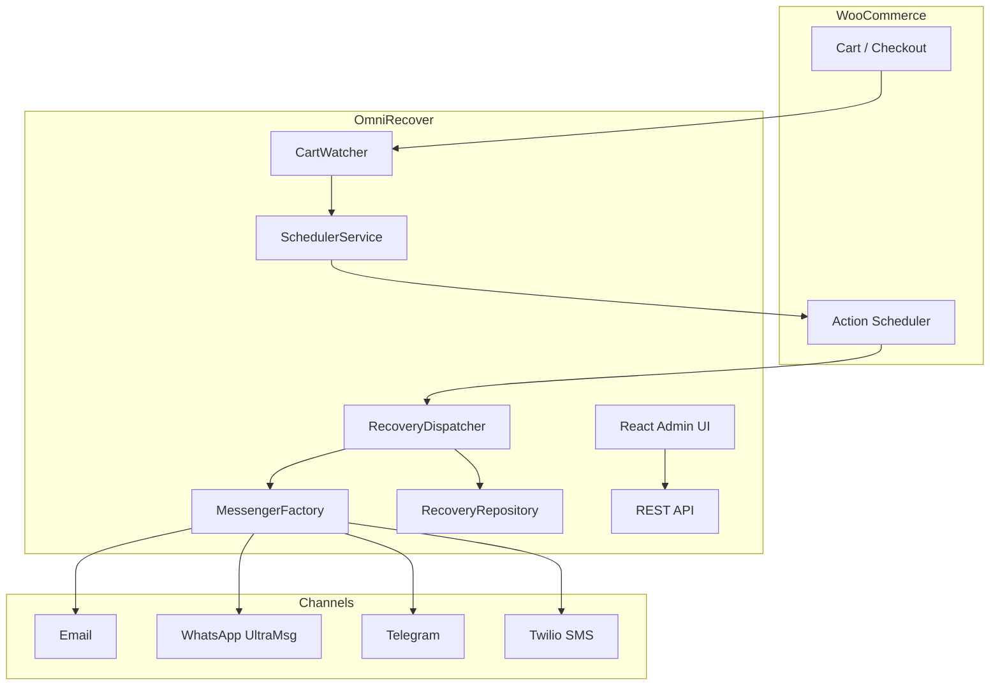

# OmniRecover for WooCommerce

[](https://wordpress.org/)
[](https://woocommerce.com/)
[](https://php.net/)
[](LICENSE)
[](https://github.com/midasmoradi/omnirecover-for-woocommerce/actions/workflows/ci.yml)

Multi-channel **abandoned cart recovery** for WooCommerce — Email, WhatsApp (UltraMsg), Telegram, and SMS (Twilio). Powered by WooCommerce Action Scheduler.

> **Author:** [Midas Moradi](https://github.com/midasmoradi)


## Features

| Layer | Description |
|-------|-------------|
| **Cart tracking** | Monitors active carts and detects abandonment |
| **Scheduling** | Recovery messages via WooCommerce Action Scheduler |
| **Multi-channel** | Email, WhatsApp, Telegram, SMS with optional fallback chain (Pro) |
| **Guest recovery** | Secure `?omnirecover_recover=` cart restore links |
| **Admin UI** | React dashboard (prebuilt `build/`, `@wordpress/scripts`) |
| **REST API** | Settings and analytics endpoints |
| **HPOS** | Compatible with WooCommerce custom order tables |
| **Privacy** | GDPR export/erase hooks |
| **Freemium-ready** | Freemius integration hook for Pro gating |

## Architecture



## Project structure

```
src/
├── Plugin.php                 # Bootstrap
├── Controllers/               # Admin, redirects, order actions
├── Services/                  # Cart watcher, scheduler, dispatcher, coupons
├── Messengers/                # Channel adapters + factory + chain
├── Models/RecoveryRepository.php
├── Rest/Api.php
└── Install/                   # Activation / deactivation
build/                         # Compiled admin assets (committed)
includes/                      # Production autoloader + Freemius init
```

## Requirements

- WordPress 6.0+
- WooCommerce 8.0+
- PHP 7.4+

## Installation

### End users

1. Download **[omnirecover-for-woocommerce-0.1.0.zip](https://github.com/midasmoradi/omnirecover-for-woocommerce/releases)** from Releases (not “Source code”).
2. Upload via **Plugins → Add New → Upload**.
3. Activate after WooCommerce is active.
4. Configure at **WooCommerce → OmniRecover**.

### Developers

```bash
git clone https://github.com/midasmoradi/omnirecover-for-woocommerce.git
cd omnirecover-for-woocommerce
composer install
npm install --registry https://registry.npmjs.org
npm run build
```

PHP loads via Composer autoload in development, or `includes/class-autoloader.php` in the release zip (no `vendor/` on production servers).

### Build release zip

```powershell
powershell -ExecutionPolicy Bypass -File .\scripts\build-release.ps1
```

Output: `releases/omnirecover-for-woocommerce-0.1.0.zip`

## Third-party services

API credentials are **only used after you save settings** in the admin:

| Channel | Provider |
|---------|----------|
| SMS | [Twilio](https://www.twilio.com/) |
| WhatsApp | [UltraMsg](https://ultramsg.com/) |
| Telegram | [Bot API](https://core.telegram.org/bots/api) |
| AI copy (Pro) | OpenAI |

## Development

```bash
composer phpcs
composer phpcbf
```

## Related projects

| Repo | Focus |
|------|-------|
| [wp-restaurant-booking](https://github.com/midasmoradi/wp-restaurant-booking) | Reservation system |
| [wp-performance-toolkit](https://github.com/midasmoradi/wp-performance-toolkit) | Performance optimization |
| [headless-wp-bridge](https://github.com/midasmoradi/headless-wp-bridge) | Go data bridge |

## License

GPL-2.0-or-later — see [LICENSE](LICENSE).
